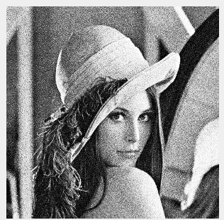
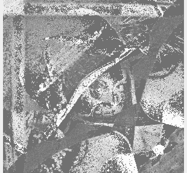

# PS2 Report

## Question 1
Nessa questão foi proposta a implementação manual de um filtro sigma e uma função para equalização de histograma da 
imagem filtrada. Além disso, foi solicitado que o parâmetro `r` da função de equalização fosse alterado para analise 
dos resultados obtidos.

O algoritmo em sí fez uso das diversas formulações disponibilizadas nos slides com a adição de um algoritmo externo para
percorrer a imagem retornando diversas janelas da mesma. Durante os testes esse algoritmo demonstrou um tempo de processamento 
de aproximadamente 10 minutos para criar uma imagem filtrada e equalizada. 

Foi possível perceber que a intensidade da equalização está intimamente relacionada ao fator `r`. Quanto maior esse 
fator maior contraste foi obtido na imagem resultante. Porém, valores de `r` acima de `1.0` adicionaram um ruído na 
imagem na medida que `r` era incrementado.

Com `r` igual a `1.0` foi possível obter um histograma equalizado que pode ser visualizado também na imagem resultante, 
visto que a mesma recebeu um contraste considerável tornando mais nítida as tonalidades de cinza.

Uma imagem bem próxima a imagem original, em termos de contrate, foi obtida com o fator `r` igual a `0`. Na medida em 
que `r` foi aumentado no intervalo de `0` a `1` foi obtida uma equalização mais fraca se comparada a equalização com o 
fator igual a `1`. De certa forma, isso era esperado uma vez que o fator `0` gerou uma imagem próxima a original e o 
fator `1` gerou uma imagem com um contraste consideravelmente melhor.

Um ponto importante a ser mencionado é o fato de que o filtro não gerou resultados esperados uma vez que ele adicionou 
a imagem ruidosa algo bem próximo a uma duplicação com base na diagonal. O resultado após a passgem pelo filtro e pela 
equalização pode ser visto abaixo.

 

## Agradecimentos:

- [Chanran Kim](https://stackoverflow.com/questions/61051120/sliding-window-on-a-python-image)

    Pelo algoritmo base para percorrer uma imagem em janelas.

- Daniel (amigo de turma)
    
    Pela disponibilidade e trabalho em equipe para a resolução dos problemas.