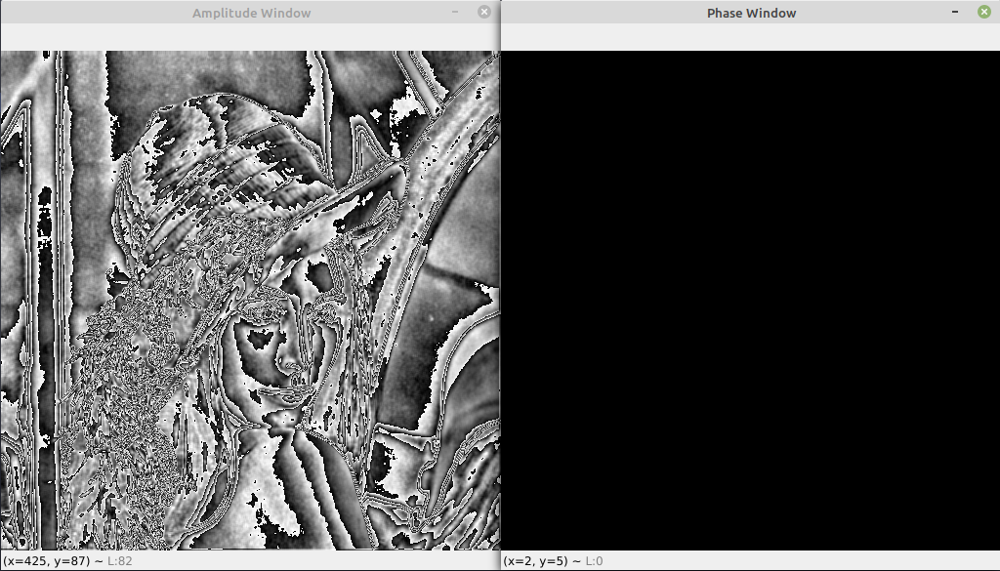
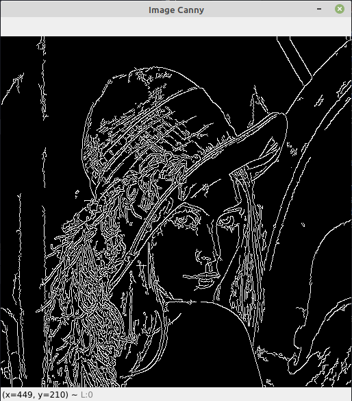

# PS2 Report

## Question 1
Nessa questão foi proposta a implementação manual de um filtro sigma e uma função para equalização de histograma da 
imagem filtrada. Além disso, foi solicitado que o parâmetro `r` da função de equalização fosse alterado para analise 
dos resultados obtidos.

O algoritmo em sí fez uso das diversas formulações disponibilizadas nos slides com a adição de um algoritmo externo para
percorrer a imagem retornando diversas janelas da mesma. Durante os testes esse algoritmo demonstrou um tempo de processamento 
de aproximadamente 10 minutos para criar uma imagem filtrada e equalizada. 

Foi possível perceber que a intensidade da equalização está intimamente relacionada ao fator `r`. Quanto maior esse 
fator maior contraste foi obtido na imagem resultante. Porém, valores de `r` acima de `1.0` adicionaram um ruído na 
imagem na medida que `r` era incrementado.

Com `r` igual a `1.0` foi possível obter um histograma equalizado que pode ser visualizado também na imagem resultante, 
visto que a mesma recebeu um contraste considerável tornando mais nítida as tonalidades de cinza.

Uma imagem bem próxima a imagem original, em termos de contrate, foi obtida com o fator `r` igual a `0`. Na medida em 
que `r` foi aumentado no intervalo de `0` a `1` foi obtida uma equalização mais fraca se comparada a equalização com o 
fator igual a `1`. De certa forma, isso era esperado uma vez que o fator `0` gerou uma imagem próxima a original e o 
fator `1` gerou uma imagem com um contraste consideravelmente melhor.

Um ponto importante a ser mencionado é o fato de que o filtro não gerou resultados esperados uma vez que ele adicionou 
a imagem ruidosa algo bem próximo a uma duplicação com base na diagonal. O resultado após a passgem pelo filtro e pela 
equalização pode ser visto abaixo.

## Question 3

A questão 3 solicitava a implementação de um detector de borda utilizando um operador local de fase e frequência. Para tal,
fez-se necessário a obtenção de uma imagem original em escala de cinza e em seguida percorrer a mesma em janelas de tamnaho `3`,
extraindo de cada janela a transformada de fourier da mesma. Neste ponto era selecionada em cada janela o pixel central para ser
decomposto e formar as imagens resultantes `M` e `P` que mostram a frequência e a fase da imagem original.

Como resultado foram obtidas duas imagens que podem ser visualizadas abaixo. A imagem `M` exibiu, com certa consideração, as bordas
da imagem original. Vale resaltar que a exibição não foi mais nítida uma vez que dado uma borda, em sua proximidades havia um leve 
decaimento na tonalidade da cor, o que fez com que a imagem ficasse clara próximo das bordas. A imagem `P` gerou uma imagem escura
que não demonstrava nenhuma nitidez de bordas. Acreditamos que isso se deve ao fato da transformada ser calculada com o centro da imagem
sendo o ponto `(0, 0)`, ponto esse que sempre continha valores iguais a 0.

Comparando os resultados com um algoritmo já estabelecido (`Canny`), percebemos que primeiramente esse se mostra mais assertivo no resultado
entregue, uma vez que a imagem gerada foi bem nítida e constrastada em comparação com a imagem `M`. Além disso, o mesmo por não ter um degradê
próximo as bordas exibe uma imagem mais intuítiva do que contém a imagem inicial. Por fim, a imagem `M` se mostra uma boa ferramenta para a
detecção de bordas sendo que se fosse possível fazer com que próximo as bordas houvesse uma queda mais bruca na tonalidade a imagem final seria
bem mais nítida. Qualitativamente, o algoritmo `Canny` se mostrou mais robusto entregando um resultado melhor.
 

## Agradecimentos:

- [Chanran Kim](https://stackoverflow.com/questions/61051120/sliding-window-on-a-python-image)

    Pelo algoritmo base para percorrer uma imagem em janelas.

- Daniel (amigo de turma)
    
    Pela disponibilidade e trabalho em equipe para a resolução dos problemas.
