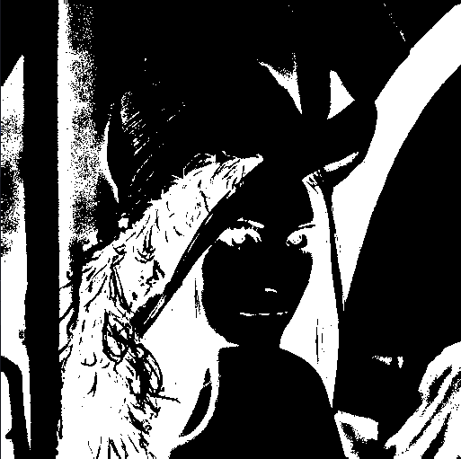

# PS3

## Question 1

Para a questão 1, primeiramente foi necessária a implementação de um algoritmo que transformasse uma imagem escalar
qualquer em uma imagem binária, dado um determinado limiar. Dessa forma, de acordo com o limiar passado como parâmetro
teríamos um resultado de imagem diferente, como pode ser visto abaixo.

Com essa primeira implementação podemos perceber que o valor do limiar e a nitidez da imagem são proporcionais, ao ponto
que um valor alto produz uma imagem branca. Percebe-se, também, que essa transformação acaba refletindo o histograma da
imagem uma vez que valores de limiar próximos da média geram imagens com uma nitidez melhor.

A segunda parte da questão solicitava uma interação com o usuário, para que, de acordo com a imagem desejada pudéssemos
disponibilizar uma contabilização dos elementos de uma imagem. Para tal, foi implementado o algoritmo de contabilização
de elementos baseado na adjacência de 8 e 4, também selecionados pelo usuário.

O algoritmo é bem próximo de um algoritmo de busca convencional adaptado para o mapeamento no plano da imagem. A ideia
foi fazer uso da adjacência para procurar por um objeto na íntegra iniciando-se por um pixel de partida da imagem sempre
armazenando os pixels visitados para evitar recontagem e sendo isso também uma condição de parada para a busca.

A princípio, foi utilizada uma abordagem recursiva, porém as limitações de pilha da linguagem direcionaram a
implementação para a utilização de laços de iteração.

A terceira parte da questão solicitava a implementação de uma aproximação para o cálculo de métricas como diâmetro, 
perímetro e área de um componente selecionado pelo usuário a partir do click no mouse.

O algoritmo dessa questão foi baseado em uma aproximação bem rústica que tem como princípio a generalização de qualquer
elemento em um retângulo. Assim, quando um pixel de um elemento é selecionado pelo usuário o algoritmo busca encontrar
as os pixels extremos a esse pixel base. Dessa forma, dado um pixel base selecionado pelo usuário, o algoritmo irá busca
pelo pixel preto na extremidade direita, esquerda, superior e inferior, sendo estes considerados como a borda do
componente. Uma vez que esse valores eram definidos calculávamos a diâmetro como a diferença entre o eixo x, a altura 
como a diferença no eixo y, o perímetro como a soma do dobro do diâmetro com o dobro da altura e a área como o produto
entre diâmetro e altura.

Infelizmente, houveram alguns erros na integração da classe modelada para a questão e o evento do mouse, o que fez com
fosse necessário fechar a janela manualmente.
