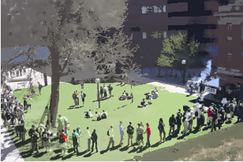
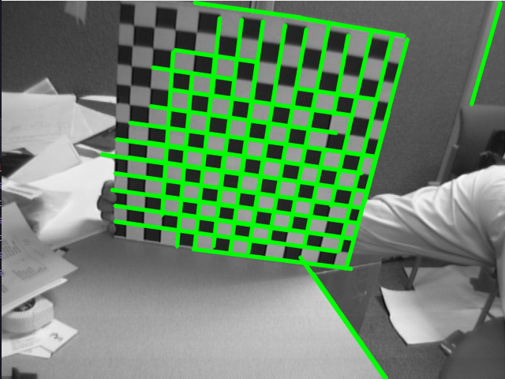
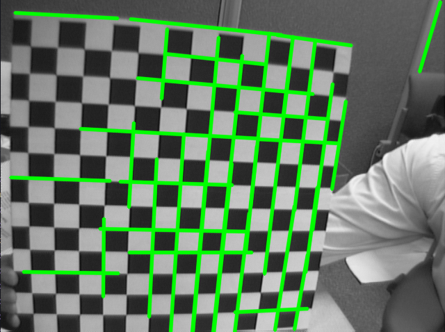

# PS4

## Questão 1

Essa questão solicitava a implementação do algoritmo de Horn and Schunck. Além disso, foi solicitado um teste em frames
próximos e uma pequena variação de parâmetros para visualização do efeito exercido pelos mesmos.

Na implementação do algoritmo realizada, foi utilizado como referência o conteúdo recomendado pelo monitor da disciplina,
além das aulas e slides disponibilizados pelo professor. Para os testes do algoritmo foi utilizado o vídeo Hamburg Taxi
Sequence e um vídeo `video.mp4` que se encontra na pasta `videos` do repositório.

O algoritmo utilizou um processo iterativo para o incremento dos vetores de velocidade, calculados para cada pixel, dada
uma determinada taxa de ajuste utilizada (lambda).

Ao final desse processo iterativo, com base em um número máximo de iterações escolhidas, foram geradas duas matrizes 
resultates que possuiam em cada pixel o módulo do vetor U e V separadamente. Para a visualização do resultado do fluxo
foram gerados dois gráficos, um que representa os vetores velocidade para cada pixel e outro com a representação dos 
vetores no espaço de cores `HSV`.

Com isso, os seguintes resultados foram obtidos:

O fator `lambda` selecionado foi de `0.05` e um total de `40` iterações


Nesse caso, foi possível perceber pequenas oscilações no movimento em alguns pixels próximos, porém ainda há, mesmo no 
caso do `vídeo`, alguns vetores velocidade para posições que na verdade são incoerêntes e isso pode ser atribuído as
aproximações das derivadas. De toda forma, há a apresentação de um fluxo de movimento.

Alterando o fator `lambda` para `0.1` e mantendo as `40` iterações obtivemos os seguintes resultados:


A mudança do fator `lambda` mantendo as 40 iterações não apresentou modificações significantes a ponto de serem notadas
a olho nú. Porém, se plotarmos os gráficos da matriz U e V veremos sim pequenas diferenças de intensidade.

Ao se adicionar uma métrica que busca inferir o erro médio por iteração, foi observado que o erro após a segunda
iteração é próximo ou igual a zero, como pode ser visto abaixo.


Essa métrica foi obtida pela diferença entre a matriz da iteração atual pela matriz da iteração anterior dividido
por dois (para ser a métrica real era necessária a divisão pelo total de pixels da imagem). A apresentação de um erro
apróximadamente igual a zero não significa uma estagnação na evoluação do algoritmo, uma vez que se o mesmo for parado
na segunda iteração e seus resultados forem comparados com um processamento feito até a quadragésima iteração, podemores
notas diferenças significando que mesmo que o erro médio seja aproximadamente zero o algoritmo continua evoluindo.

Vetor U e V com 2 e 40 iterações, respectivamente.


Com isso, percebemos que não é possível definir tão bem um limiar que servirá como critério de parada nesse caso. Nos
testes gerais aumentamos a quantidade de iterações para 100 e não percebemos modificações significativas a ponto do
aumento de iterações provar sua valia. Dessa forma, a quantidade de 40 iterações parece ser rasoavél para a maioria dos
problemas. Sabemos que uma vez que nossas aproximações foram iniciadas com uma matriz de zeros, o aumento das iterações
tende a aproximar cada vez melhor os vetores de movimento e também as aproximações para a derivada. Porém, há um
determinado ponto onde essas modificações não são significativas.

## Questão 2

Na segunda questão, foi solicitado que alterássemos os parâmetros da função `pyrMeanSheftFiltering` para entendimento e
consolidação do conteúdo de segmentação de imagens utilizando a abordagem do `Mean Shift`.

Todas as imagens resultantes dessas modificações podem ser conferidas no diretório `ps4/result_images`, onde os nomes
representam os parâmetros `sp`, `sr` e `L` utilizados para produzir a imagem. Por exemplo, a imagem com o nome
`lenna_12_19_1` foi a imagem produzida utilizando como base a imagem da `lenna` e os parâmetros `sp=12`, `sr=19` e `L=1`
.

### Parâmetro SP

Para este parâmetro, o seu aumentou representou um custo computacional maior. O que era esperado, uma vez que ele
representa o tamanho das janelas do espaço de features da imagem. O seu crescimento também mostrou um crescimento nas
regiões segmentadas, trazendo um efeito bem próximo de uma pintura a óleo.

### Parâmetro SR

Esse parâmetro está relacionado com a abrangência de cores captadas por uma janela de segmentação, de modo que, o seu
crescimento representa uma diminuição nas cores que compõem a imagem. Isso foi atestado nos testes, uma vez que 
aumentando o parâmetro foi possível perceber que maiores regiões eram aproximadas dado que a abrangência de tons foi
aumentada. 

### Parâmetro L

Tal parâmetro está relacionado com a quantidade de níveis da pirâmide da imagem e, acredita-se que a função utiliza a 
imagem no topo da pirâmide. Esse uso, faz com que maiores níveis utilizados gerem imagens que já são aproximações de 
uma imagem base, ampliando efeitos de pixelagem na imagem. Uma das imagens de exemplo, quando teve seu `L` igual a 6, 
apresentou efeitos de brusca perda de detalhes na borda e próximo ao chapéu da personagem.

### O Caso da Imagem Spring

Nessa imagem, a segmentação se torna um objetivo bem mais complexo do que o esperado, uma vez que há grandes variações 
de tons em contantes blocos, ou janelas, da imagem. Isso faz com que a complexidade da aproximação seja aumentada 
dificultando a identificação de segmentos, ou criando diversos segmentos pequenos.



## Questão 3

A questão 3 solicitava a utilização de um método de detecção de linhas para a identificação de cantos em imagens 
normalmente utilizadas na calibração de câmeras. Utilizamos o método `HoughLinesP` na detecção de linhas e os seguintes
resultados foram obtidos:





A partir das imagens e dos conhecimentos obtidos em aula, podemos perceber que a detecção de cantos/quinas é afetada 
pela distorção radial das lentes, uma vez que, como pode-se perceber, a aproximação do objeto fez com que as bordas não
fossem detectadas linearmente, como de fato o são, mas fez com que as mesmas fossem registradas como uma curva 
necessitando que mais de uma linha fosse traçada para delimitar uma mesma borda do objeto. Em termos gerais, quanto 
maior a aproximação do objeto da câmera, maior o efeito da distorção na imagem. 

## Referências

- https://opencv-python-tutroals.readthedocs.io/en/latest/py_tutorials/py_imgproc/py_houghlines/py_houghlines.html
- https://www.youtube.com/watch?v=DkYpi8_AyoI&t=2s

## Obs:

Qualquer questão pode ser facilmente testada executando o seguinte comando no diretório `ps4`:

```bash
python main.py
```
