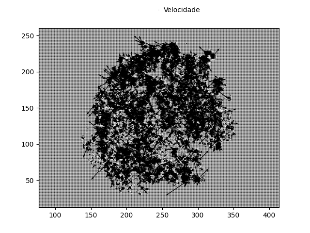

# PS4

## Questão 1

Essa questão solicitava a implementação do algoritmo de Horn and Schunck. Além disso, foi solicitado um teste em frames
próximos e uma pequena variação de parâmetros para visualização do efeito exercido pelos mesmos.

Na implementação do algoritmo realizada, foi utilizado como referência o conteúdo recomendado pelo monitor da disciplina,
além das aulas e slides disponibilizados pelo professor. Para os testes do algoritmo foi utilizado o vídeo Hamburg Taxi
Sequence e um vídeo `video.mp4` que se encontra na pasta `videos` do repositório.

O algoritmo utilizou um processo iterativo para o incremento dos vetores de velocidade, calculados para cada pixel, dada
uma determinada taxa de ajuste utilizada (lambda).

Ao final desse processo iterativo, com base em um número máximo de iterações escolhidas, foram geradas duas matrizes 
resultates que possuiam em cada pixel o módulo do vetor U e V separadamente. Para a visualização do resultado do fluxo
foram gerados dois gráficos, um que representa os vetores velocidade para cada pixel e outro com a representação dos 
vetores no espaço de cores `HSV`.

Com isso, os seguintes resultados foram obtidos:

O fator `lambda` selecionado foi de `0.05` e um total de `40` iterações

Nesse caso, foi possível perceber pequenas oscilações no movimento em alguns pixels próximos, porém ainda há, mesmo no 
caso do `vídeo`, alguns vetores velocidade para posições que na verdade são incoerêntes e isso pode ser atribuído as
aproximações das derivadas. De toda forma, há a apresentação de um fluxo de movimento.

Alterando o fator `lambda` para `0.1` e mantendo as `40` iterações obtivemos os seguintes resultados:

A mudança do fator `lambda` mantendo as 40 iterações não apresentou modificações significantes a ponto de serem notadas
a olho nú. Porém, se plotarmos os gráficos da matriz U e V veremos sim pequenas diferenças de intensidade.

Ao se adicionar uma métrica que busca inferir o erro médio por iteração, foi observado que o erro após a segunda
iteração é próximo ou igual a zero, como pode ser visto abaixo.

Essa métrica foi obtida pela diferença entre a matriz da iteração atual pela matriz da iteração anterior dividido
por dois (para ser a métrica real era necessária a divisão pelo total de pixels da imagem). A apresentação de um erro
apróximadamente igual a zero não significa uma estagnação na evoluação do algoritmo, uma vez que se o mesmo for parado
na segunda iteração e seus resultados forem comparados com um processamento feito até a quadragésima iteração, podemores
notas diferenças significando que mesmo que o erro médio seja aproximadamente zero o algoritmo continua evoluindo.

Vetor U e V com 2 e 40 iterações, respectivamente.

Com isso, percebemos que não é possível definir tão bem um limiar que servirá como critério de parada nesse caso. Nos
testes gerais aumentamos a quantidade de iterações para 100 e não percebemos modificações significativas a ponto do
aumento de iterações provar sua valia. Dessa forma, a quantidade de 40 iterações parece ser rasoavél para a maioria dos
problemas. Sabemos que uma vez que nossas aproximações foram iniciadas com uma matriz de zeros, o aumento das iterações
tende a aproximar cada vez melhor os vetores de movimento e também as aproximações para a derivada. Porém, há um
determinado ponto onde essas modificações não são significativas.

## Questão 2

